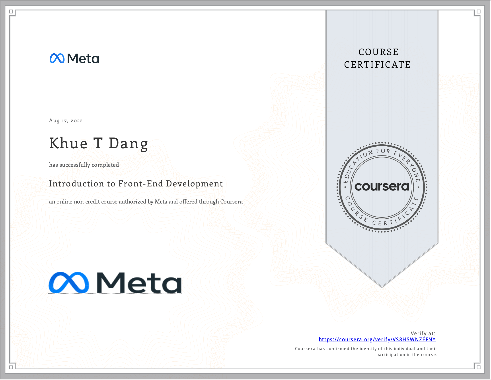

# Introduction to Front-End Development

- This directory contains all of my assignments from the Coursera Course: [Introduction to Front-End Development](https://www.coursera.org/learn/introduction-to-front-end-development?specialization=meta-front-end-developer)

## Table of Content

- Week 1: [Get started with web development](https://github.com/ginny100/Meta-Front-End-Developer/tree/master/Course%201%20-%20Introduction%20to%20Front-End%20Development/Week%201%20-%20Get%20started%20with%20web%20development)
- Week 2: [Introduction to HTML and CSS](https://github.com/ginny100/Meta-Front-End-Developer/tree/master/Course%201%20-%20Introduction%20to%20Front-End%20Development/Week%202%20-%20Introduction%20to%20HTML%20and%20CSS)
- Week 3: [UI Frameworks](https://github.com/ginny100/Meta-Front-End-Developer/tree/master/Course%201%20-%20Introduction%20to%20Front-End%20Development/Week%203%20-%20UI%20Frameworks)
- Week 4: [End-of-Course Graded Assessment](https://github.com/ginny100/Meta-Front-End-Developer/tree/master/Course%201%20-%20Introduction%20to%20Front-End%20Development/Week%204%20-%20End-of-Course%20Graded%20Assessment)

## Proof of Completion

