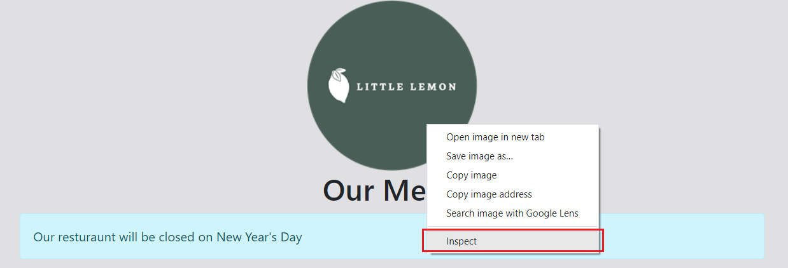
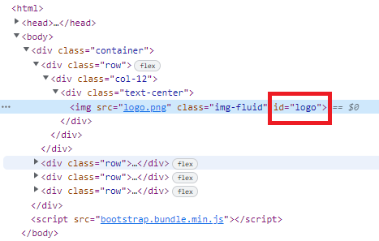

# Exercise: Examine a web page

## Introduction
In this exercise, you will practice examining an HTML page using the developer tools.

## Goal
Inspect the HTML document using the developer tools in your browser.

## Objectives
Find the HTML ID of the Little Lemon logo.

## Instructions
- __Step 1:__ Double click index.html to view the file in your local web browser. Verify that it looks like this

  

- __Step 2:__ Right-click the Little Lemon logo and select `Inspect` (or `Inspect Element`)
  
  

- __Step 3:__ Inspect the line in the HTML for the logo in the developer tools panel. The line begins with `

  

## Tips
- If you get stuck, close the developer tools and start over.
- Review the lesson Developer Tools.

# Exercise: Edit a website using a browser developer tools

## Introduction
In this exercise, you will practice editing an HTML page using the developer tools.

## Goal
Edit the HTML document using the developer tools in your browser.

## Objectives
Change the text of Our Menu to Little Lemon Menu.

## Instructions
- __Step 1:__ Double click index.html to view the file in your local web browser. Verify that it looks like this

  

- __Step 2:__ Right-click the `Our Menu` text and select `Inspect` (or `Inspect Element`)
  
  

- __Step 3:__ Double-click the `Our Menu` text in the Elements tab of the developer tools panel.

- __Step 4:__ Change the text to `Little Lemon Menu`.

- __Step 5:__ Close the developer tools.

- __Step 6:__ Verify that the text has changed on the web page.

## Tips
- If you get stuck, close the developer tools and start from the beginning.
- Review the lesson _Developer Tools_.