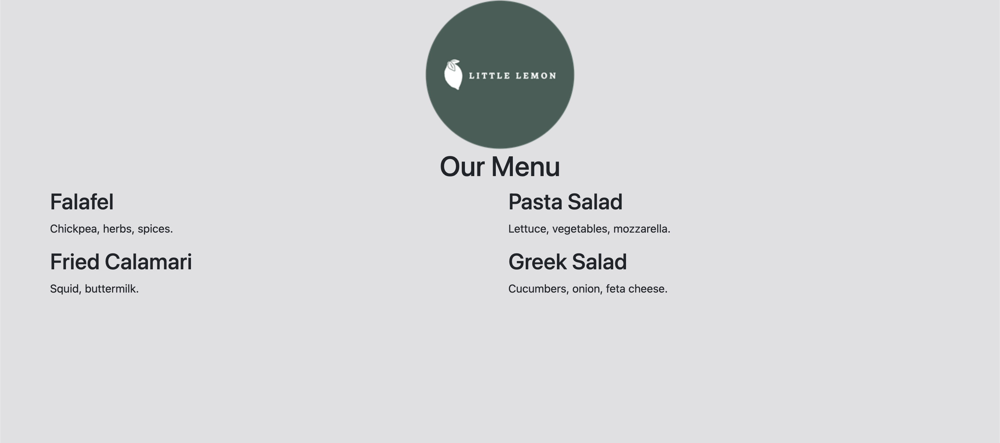

# Lab: Working with Bootstrap grid

## Introduction
In this exercise, you will practice building a webpage using the Bootstrap Grid.

## Goal
- Create a two-column food menu for Little Lemon.

## Objectives
- Set up the Bootstrap container.
- Display the Little Lemon logo in the top center of the webpage using Bootstrap.
- Display the food menu in two columns using Bootstrap Grid.

## Instructions
__Step 1:__ Open index.html

__Step 2:__ Add a div element inside the body element. This div will be the Bootstrap container.

__Step 3:__ Add the class attribute to this element with the value container.
```
<body>
    <div class="container">
    </div>
</body>
```

__Step 4:__ Add three div elements to the Bootstrap container element. Each of these div elements will be a Bootstrap row. Add the class attribute to this element with the value row.
```
<body>
    <div class="container">
        <div class="row">
        </div>
        <div class="row">
        </div>
        <div class="row">
        </div>
    </div>
</body>
```

__Step 5:__ The first row will contain the Little Lemon logo. Add a div element to the first row. 

__Step 6:__ Add the class attribute to this element with the value col-12. This will take up 12 column spaces.
```
<body>
    <div class="container">
        <div class="row">
            <div class="col-12">
            </div>
        </div>
        <div class="row">
        </div>
        <div class="row">
        </div>
    </div>
</body>
```

__Step 7:__ Add another div element to the col-12 element. 

__Step 8:__ Add the class attribute to this element with the value text-center. This will allow you to center the logo.
```
<body>
    <div class="container">
        <div class="row">
            <div class="col-12">
                <div class="text-center">
                </div>
            </div>
        </div>
        <div class="row">
        </div>
        <div class="row">
        </div>
    </div>
</body>
```

__Step 9:__ Add an image element in the text-center element with the img-fluid class applied to it.
```
<body>
    <div class="container">
        <div class="row">
            <div class="col-12">
                <div class="text-center">
                    
                </div>
            </div>
        </div>
        <div class="row">
        </div>
        <div class="row">
        </div>
    </div>
</body>
```

__Step 10:__ In the second row, add another div element with the class col-12.
```
<body>
    <div class="container">
        <div class="row">
            <div class="col-12">
                <div class="text-center">
                    
                </div>
            </div>
        </div>
        <div class="row">
            <div class="col-12">
            </div>
        </div>
        <div class="row">
        </div>
    </div>
</body>
```

__Step 11:__ Add a div element to the column and apply the class text-center.
```
<body>
    <div class="container">
        <div class="row">
            <div class="col-12">
                <div class="text-center">
                    
                </div>
            </div>
        </div>
        <div class="row">
            <div class="col-12">
                <div class="text-center">
                </div>
            </div>
        </div>
        <div class="row">
        </div>
    </div>
</body>
```

__Step 12:__ Inside the element, add an h1 element with the text Our Menu.
```
<body>
    <div class="container">
        <div class="row">
            <div class="col-12">
                <div class="text-center">
                    
                </div>
            </div>
        </div>
        <div class="row">
            <div class="col-12">
                <div class="text-center">
                    <h1>Our Menu</h1>
                </div>
            </div>
        </div>
        <div class="row">
        </div>
    </div>
</body>
```

__Step 13:__ Add two div elements in the final row. 

__Step 14:__ Add a class attribute to each element with the value col-12 col-lg-6.
```
<body>
    <div class="container">
        <div class="row">
            <div class="col-12">
                <div class="text-center">
                    
                </div>
            </div>
        </div>
        <div class="row">
            <div class="col-12">
                <div class="text-center">
                    <h1>Our Menu</h1>
                </div>
            </div>
        </div>
        <div class="row">
            <div class="col-12 col-lg-6">
            </div>
            <div class="col-12 col-lg-6">
            </div>
        </div>
    </div>
</body>
```

__Step 15:__ Add the following elements in the first col-12 col-lg-6 element: 
- An h2 element containing the text Falafel.
- A paragraph element containing the text Chickpea, herbs, spices.
- An h2 element containing the text Fried Calamari.
- A paragraph element containing the text Squid, buttermilk.

__Step 16:__ Add the following elements In the second col-12 col-lg-6 element:
- An h2 element containing the text Pasta Salad.
- A paragraph element containing the text Lettuce, vegetables, mozzarella.
- An h2 element containing the text Greek Salad.
- A paragraph element containing the text Cucumbers, onion, feta cheese.
```
<body>
    <div class="container">
        <div class="row">
            <div class="col-12">
                <div class="text-center">
                    
                </div>
            </div>
        </div>
        <div class="row">
            <div class="col-12">
                <div class="text-center">
                    <h1>Our Menu</h1>
                </div>
            </div>
        </div>
        <div class="row">
            <div class="col-12 col-lg-6">
                <h2>Falafel</h2>
                <p>Chickpea, herbs, spices.</p>
                <h2>Fried Calamari</h2>
                <p>Squid, buttermilk.</p>
            </div>
            <div class="col-12 col-lg-6">
                <h2>Pasta Salad</h2>
                <p>Lettuce, vegetables, mozzarella.</p>
                <h2>Greek Salad</h2>
                <p>Cucumbers, onion, feta cheese.</p>
            </div>
        </div>
    </div>
</body>
```

__Step 17:__ Save the file.

## Final Result

