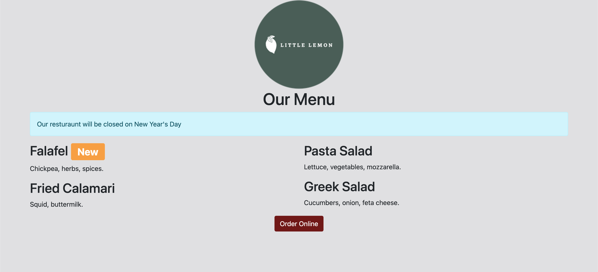

# Lab: Working with Bootstrap components

## Introduction
In this exercise, you will practice adding Bootstrap components to a webpage.

## Goal
- Update the Little Lemon website to use Bootstrap Components.

## Objectives
- Add a Badge component to the page to notify customers of the new falafel dish.
- Add an Alert component to the page to notify customers that the restaurant will be closed on New Year's Day.
- Add a Button component to the page with the text Order Online.

## Instructions
__Step 1:__ Open index.html

__Step 2:__ Add another div element below the Our Menu text-center div element.

__Step 3:__ Add a `class` attribute to the element with the value `alert alert-info`.

__Step 4:__ Add a `role` attribute to the element with the value `alert`.

__Step 5:__ Add the message Our restaurant will be closed on New Year's Day, inside the div element.
```
<div class="row">
    <div class="col-12">
        <div class="text-center">
            <h1>Our Menu</h1>
        </div>
        <div class="alert alert-info" role="alert">
            Our resturaunt will be closed on New Year's Day
        </div>
    </div>
</div>
```

__Step 6:__ Add a `span` element inside the Falafel h2 element, before the closing h2 tag.

__Step 7:__ Add a `class` attribute to the span element, with the value `badge bg-secondary`.
```
<h2>Falafel <span class="badge bg-secondary">New</span></h2>
```

__Step 8:__ Add another `div` element after the last row element.

__Step 9:__ Add a `class` attribute with the value `row` to the div element.

__Step 10:__ Add a div element inside the row div element.

__Step 11:__ Add a `class` attribute with the value col-12 to the div element.

__Step 12:__ Add another `div` element inside the col-12 div element.

__Step 13:__ Add a `class` attribute with the value `text-center` to the div element.

__Step 14:__ Add a `button` element inside the text-center div element.

__Step 15:__ Add a `type` attribute with the value `button`.

__Step 16:__ Add a `class` attribute with the value `btn btn-primary`.

__Step 17:__ Add the text `Order Online` inside the button element.
```
<div class="row">
    <div class="col-12">
        <div class="text-center">
            <button type="button" class="btn btn-primary">Order Online</button>
        </div>
    </div>
</div>
```

__Step 18:__ Save the file.

## Tips
- Make sure to add your columns to row elements.
- Remember that Bootstrap uses a 12 column grid system.
- There are plenty of examples in the Bootstrap documentation.
- Review the lessons _Using Bootstrap Styles_ and _Bootstrap Components_.

## Final Result

