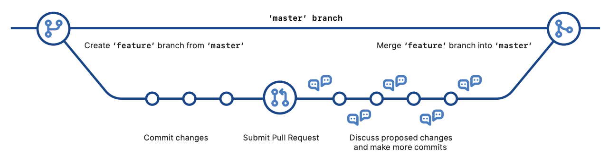

# Git Cheat Sheet (by GitHub)

Git is the open source distributed version control system that facilitates GitHub activities on your laptop or desktop. This cheat sheet summarizes commonly used Git command line instructions for quick reference.

## Install

__GitHub for Windows__

https://windows.github.com

__GitHub for Mac__

https://mac.github.com

__Git for All Platforms__

http://git-scm.com

Git distributions for Linux and POSIX systems are available on the official Git SCM web site.

## Configure tooling

Configure user information for all local repositories

- Sets the name you want attached to your commit transactions
    ```
    git config --global user.name "[name]"
    ```

- Sets the email you want attached to your commit transactions
    ```
    git config --global user.email "[email address]"
    ```

- Enables helpful colorization of command line output
    ```
    git config --global color.ui auto
    ```

## Create repositories

When starting out with a new repository, you only need to do it once; either locally, then push to GitHub, or by cloning an existing repository.

- Turn an existing directory into a git repository
    ```
    git init
    ```

- Clone (download) a repository that already exists on GitHub, including all of the files, branches, and commits
    ```
    git clone [url]
    ```

## The .gitignore file

Sometimes it may be a good idea to exclude files from being tracked with Git. This is typically done in a special file named `.gitignore`. You can find helpful templates for `.gitignore` files at [github.com/github/gitignore](https://github.com/github/gitignore).

## Branches

Branches are an important part of working with Git. Any commits you make will be made on the branch you're currently “checked out” to. Use `git status` to see which branch that is.

- Creates a new branch
    ```
    git branch [branch-name]
    ```

- Switches to the specified branch and updates the working directory
    ```
    git checkout [branch-name]
    ```

- Combines the specified branch’s history into the current branch. This is usually done in pull requests, but is an important Git operation.
    ```
    git merge [branch]
    ```

- Deletes the specified branch
    ```
    git branch -d [branch-name]
    ```

## Synchronize changes

Synchronize your local repository with the remote repository on GitHub.com

- Downloads all history from the remote tracking branches
    ```
    git fetch
    ```

- Combines remote tracking branch into current local branch
    ```
    git merge
    ```

- Uploads all local branch commits to GitHub
    ```
    git push
    ```

- Updates your current local working branch with all new commits from the corresponding remote branch on GitHub. `git pull` is a combination of `git fetch` and `git merge`
    ```
    git pull
    ```

## Make changes

Browse and inspect the evolution of project files

- Lists version history for the current branch
    ```
    git log
    ```

- Lists version history for a file, including renames
    ```
    git log --follow [file]
    ```

- Shows content differences between two branches
    ```
    git diff [first-branch]...[second-branch]
    ```

- Outputs metadata and content changes of the specified commit
    ```
    git show [commit]
    ```

- Snapshots the file in preparation for versioning
    ```
    git add [file]
    ```

- Records file snapshots permanently in version history
    ```
    git commit -m "[descriptive message]"
    ```

## Redo commits

Erase mistakes and craft replacement history

- Undoes all commits after [commit], preserving changes locally
    ```
    git reset [commit]
    ```

- Discards all history and changes back to the specified commit
    ```
    git reset --hard [commit]
    ```

CAUTION! Changing history can have nasty side effects. If you need to change commits that exist on GitHub (the remote), proceed with caution. If you need help, reach out at github.community or contact support.

## GitHub Flow



## Glossary

__git:__ an open source, distributed version-control system

__GitHub:__ a platform for hosting and collaborating on Git repositories

__commit:__ a Git object, a snapshot of your entire repository compressed into a SHA

__branch:__ a lightweight movable pointer to a commit

__clone:__ a local version of a repository, including all commits and branches

__remote:__ a common repository on GitHub that all team member use to exchange their changes

__fork:__ a copy of a repository on GitHub owned by a different user

__pull request:__ a place to compare and discuss the differences introduced on a branch with reviews, comments, integrated tests, and more

__HEAD:__ representing your current working directory, the HEAD pointer can be moved to different branches, tags, or commits when using `git checkout`

-------

### __GitHub__ Training

Want to learn more about using GitHub and Git?

Email the Training Team or visit our web site for learning event schedules and private class availability.

services@github.com

[services.github.com](https://services.github.com/)
