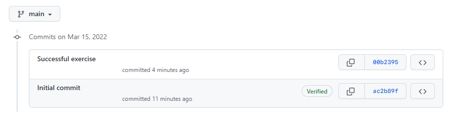

# Lab: Using A Repository

## Instructions

__Step 1:__ Create a new repository on your Github account named "`repo-exercise`". Ensure that "`Add a README file`" is selected.

__Step 2:__ Open the Terminal and authenticate using gh (Github CLI):
```
gh auth login
```

__Step 3:__ Create an authentication token in your Github account with specified scopes given in the terminal. Copy it from Github and paste it. Verify authorization was successful.


__Step 4:__ Clone the repository using its GitHub CLI.
```
gh repo clone <YOUR USERNAME>/<REPOSITORY-NAME>
```

__Step 5:__ Move to the repo directory by using
```
cd <REPOSITORY-NAME>
```

__Step 6:__ Download and add the `result.txt` to the repository folder on your local machine

__Step 7:__ In the Git terminal, run
```
git status
```

__Step 8:__ Verify that the output shows `result.txt` as an untracked file.

__Step 9:__ Run the command 
```
git add result.txt
```

__Step 10:__ Run this command again.
```
git status
```

__Step 11:__ Verify that the output shows `result.txt` as a tracked file.

__Step 12:__ Next, run the command
```
git commit -m "Successful exercise"
```

__Step 13:__ Verify that the output shows `result.txt` with create mode

__Step 14:__ Next, run
```
git push
```

__Step 15:__ Verify that the output pushed successfully.

__Step 16:__ On Github, go to your repository page.

__Step 17:__ Verify that the `result.txt` file is listed. You may need to refresh the page to see the changes.

## Self review

Complete the following steps to answer the question below.

__Step 1:__ Go to Github

__Step 2:__ Go to the repository that you created during the exercise

__Step 3:__ Click on the commit history of the repository.  

Does the most recent commit message on your respository contain the text Successful exercise similar to the screenshot below?



- Yes
- No

```
Answer: Yes
Explanation: You completed the exercise correctly.
```