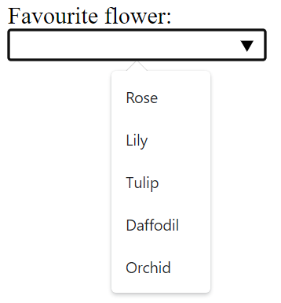
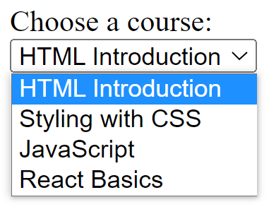

# Glossary: HTML form elements

## `<input>`

It is used to create interactive controls, for example, buttons and various types of text fields and so on, to accept input or data from the user. The key attribute of this element is `type`. Some common values for the `type` include: `button`, `checkbox`, `date`, `email`, `number`, `password`, `submit`, `text`, and `url`. These values dictate the appearance of the element. For example, this code:

```html
<form action="my_action_page"> 
    <label for="uname">Username:</label> 
    <br> 
    <input type="text" id="uname" name="username"> 
    <br> 
    <label for="pwd">Password:</label> 
    <br> 
    <input type="password" id="pwd" name="pwd"> 
    <br><br> 
    <input type="submit" value="Login">
</form> 
```

Results in the following output:


Note how the type `password` hides the user input. 

## `<label>`

Defines a label for an element. It has an attribute "for", the value of which should be equal to the id attribute of the element it is associated with. Note how in the example above, the `<label>` is associated with the `<input>` using its id value. 

## `<select>`

Defines a drop-down list of options presented to the user. It has a couple of attributes: 

- Form, the id of the form in which the drop-down appears 

- Name specifies the name of the control 

- Multiple Boolean attribute, when specified, indicates if a user can select multiple options out of the list 

- Required indicates if the user is required to select an option before submitting a form 

- Size mentions the number of visible options in a drop-down list 

The options in a drop-down list are defined using the `<option>` element inside `<select>`. Note the example in the `<option>` description below. 

## `<textarea>`

Defines a multi-line input field, typically to allow the user to input longer textual data. The common attributes for this element include: 

- `cols` defines the width of the text area, the default value is 20 

- `form` the form element the text area is associated with 

- `maxlength` when specified, limits the maximum number of characters that can be entered in the text area 

- `minlength` the minimum number of characters that the user should enter 

- `readonly` once set, the user cannot modify the contents 

- `rows` defines the number of visible text lines for the text area 

The following line of code defines a text area of 10 visible lines and nearly 30 characters wide where the user can input a maximum of 200 characters:

```html
<textarea name="response" rows="10" cols="30" maxlength=”200”> 

</textarea> 
```

## `<button>`

Defines a clickable button. The `onclick` attribute defines the behavior when the button is clicked by the user. For example, in the code below, an alert message is shown to the user.

```html
<button type="button" onclick="alert('You just clicked!')">Click Me! 
</button>
```

## `<fieldset>`

Used to group related input elements in a form. For instance, elements related to the user’s personal information and educational qualification can be grouped separately in two field sets. 

## `<legend>`

Defines a caption for the `<fieldset>` element. For example:

```html
<fieldset> 
    <legend>Personal Info</legend> 
    <label for="fname">First name:</label><br> 
    <input type="text" id="fname" name="fname" value="John"><br> 
    <label for="lname">Last name:</label><br> 
    <input type="text" id="lname" name="lname" value="Doe"><br> 
</fieldset> 

<fieldset> 
    <legend>Qualificaiton</legend> 
    <label for="pdegree">Primary degree:</label><br> 
    <input type="text" id="pdegree" name="degree" value="Masters"><br> 
    <label for="fos">Last name:</label><br> 
    <input type="text" id="fos" name="field" value="Psychology"><br> 
</fieldset>
```

## `<datalist>`

Specifies a list of pre-defined options for an input element. It differs from `<select>` since the user can still provide textual or numeric input other than the listed options.

```html
<form action="/my_action_page"> 
    <label for="flowers">Favourite flower:</label><br> 
    <input list="flowers" name="flowers"> 
    <datalist id="flowers"> 
        <option value="Rose"> 
        <option value="Lily"> 
        <option value="Tulip"> 
        <option value="Daffodil"> 
        <option value="Orchid"> 
    </datalist> 
    ... 
</form>
```



## `<output>`

Represents the result of a calculation (typically the output of a script) or the outcome of the user action. 

## `<option>`

Defines an option for the drop-down list. The following code example demonstrates how a simple list can be defined, with the rendered view below the code block.

```html
<label for="course">Choose a course:</label><br> 
<select id="course" name="courselist"> 
    <option value="html">HTML Introduction</option> 
    <option value="css">Styling with CSS</option> 
    <option value="js">JavaScript</option> 
    <option value="react">React Basics</option> 
</select> 
```



By default, the first item in the drop-down list is selected. To define a pre-selected option, add the selected attribute to the option. 

## `<optgroup>`

Defines a group of related options in a drop-down list. Its attribute label names the group.