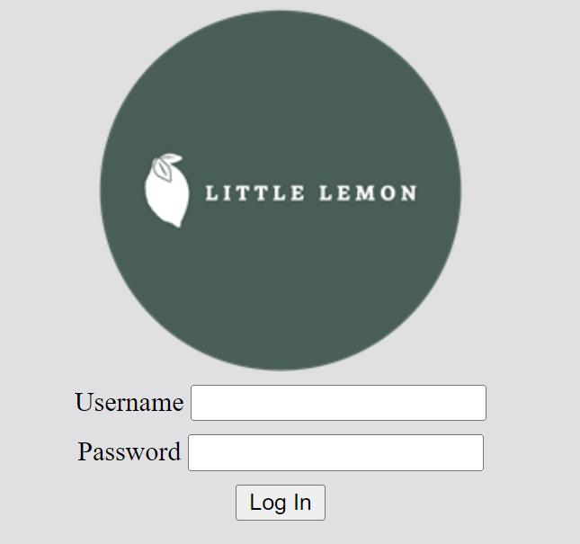

# Create and test a form

In this exercise, you’ll create a basic login form for the Little Lemon website. The form will contain two fields: one for the username and another for the password. Both fields are required fields and must have a minimum text length of 2. The form will also contain a button to submit the form.

## Instructions

__Step 1:__ First add a form element to the body of the HTML document.

__Step 2:__ Next, add two div elements; one for the username field and one for the password.

__Step 3:__ In the first div element, add a label element for the username.

__Step 4:__ After the label, add an input element for the username.

__Step 5:__ Add the required and minlength attributes. Set the minlength attribute value to 2 so that the field requires a minimum text length of 2.

__Step 6:__ Add an id attribute to the input element. Ensure that the for attribute of the label is set to match the id.

__Step 7:__ In the second div element, add a label element for the password.

__Step 8:__ After the label, add an input element for the password. Ensure the correct input type is used so that the inputted data is not visible on screen.

__Step 9:__ Add an id attribute to the input element. Ensure that the for attribute of the label is set to match the id.

__Step 10:__ Add the required and minlength attributes to the input element. Set the minlength attribute value to 2 so that the field requires a minimum text length of 2.

__Step 11:__ Add a name attribute to all input elements.

__Step 12:__ After the second div element, add a button element containing the text "Log In".

__Step 13:__ Set the type attribute of the button element to submit.

__Step 14:__ Save the HTML document and open it in Live Preview.

__Step 15:__ Click the Log In button and note if the form submits successfully. The form submits successfully when no errors are displayed and the content of the form resets.

__Step 16:__ Add one character of text to both input fields. Again, click the Log In button and note if the form submits successfully.

__Step 17:__ Type the text "admin" in the username field. Then type the text "password" in the password field. Click the Log In button and note if the form submits successfully.

__Tips:__ 

- Refer to your cheat sheets and glossary from previous lessons.

When you complete the exercise, the web page should be similar to the following image.

