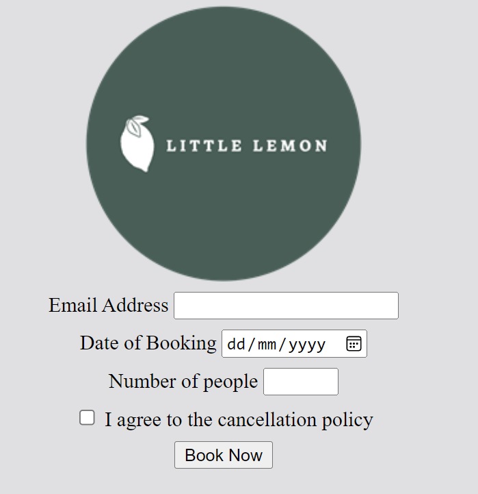

# Create a complex form

In this exercise, you’ll create a table booking form for the Little Lemon website. The form will contain four fields: email address, date of booking, number of people and a checkbox to confirm agreement with the cancellation policy. The form will also have a submit button.

## Instructions

__Step 1:__ First add a form element to the body of the HTML document.

__Step 2:__ Next, add four div elements; one for each input field. 

__Step 3:__ In the first div element, add a label element and an input element for the email address. Ensure that you use the correct type attribute to the input element to apply client-side validation.

__Step 4:__ In the second div element, add a label element and an input element for the date of booking. Set the type attribute to date to allow for a date picker to appear when the user interacts with the form. Note that if using Live Preview, the date picker will not appear. 
However, if you launch the web page in a new web browser tab, it will appear.

__Step 5:__ In the third div element, add a label element and an input element for the number of people. Set the type attribute to number and apply the appropriate attributes so that the minimum value is 1 and the maximum value is 8.

__Step 6:__ In the fourth div element, add a label element. Set the text of the label element to "I agree to the cancellation policy".

__Step 7:__ Add an input element to the label and set its type attribute to checkbox. Apply the required attribute to the element.

__Step 8:__ After the fourth div element, add a button element and set its text to "Book Now". Set its type attribute to submit.

__Step 9:__ For each input element, add a name attribute.  

__Step 10:__ Save the HTML document and open it in Live Preview.

__Step 11:__ Click the date of booking field. Note the result.

__Step 12:__ Type the word "hello" into the email address field. Set the date field to today and the number of people to 1.

__Note__ The date picker element is not supported in the Live Preview.

__Step 13:__ Click the checkbox and then click the Book Now button. Note the result.

__Tips:__

- Refer to your cheat sheets and glossary from previous lessons. 

When you finish the exercise, the output should be similar to the following image.

