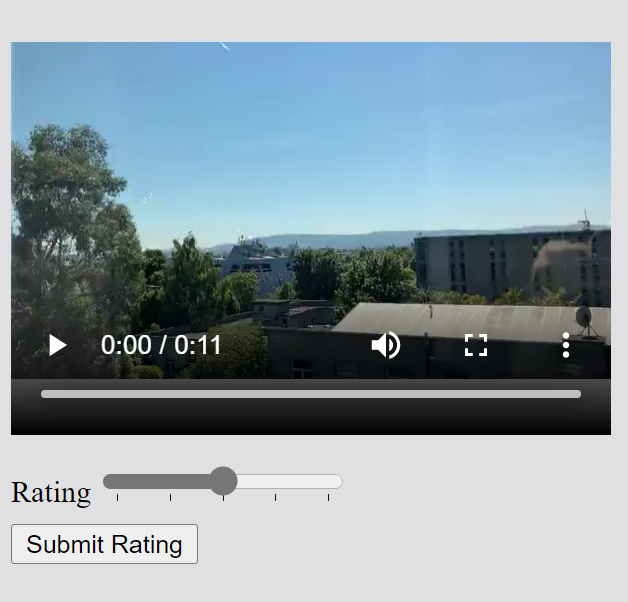

# Rate the media

In this exercise, you’ll create a web page for rating a video. The page will display a video player with playback controls. There will also be a HTML form for rating the video. The form will contain a slider element to rate video between 1 out of 5 and 5 out of 5.

## Instructions

__Step 1:__ First add a video element to the body element of the HTML document. Apply the controls attribute to enable playback controls.

__Step 2:__ The width of the video will be 320 and the height will be 240. Apply the corresponding attributes to the video element.

__Step 3:__ Next, add a source element to the video element.

__Step 4:__ Set the src attribute of the source element to video.mp4 and the type attribute to video/mp4.

__Step 5:__ After the video element add a form element.

__Step 6:__ Add a div element to the form for the rating field.

__Step 7:__ In the div element, add a label for the rating. Set the for attribute to rating.

__Step 8:__ After the label, add an input element and set its type attribute to range.

__Step 9:__ Set the id and name attributes to rating.

__Step 10:__ Set the min attribute to 1 and the max attribute to 5. 

__Step 11:__ Set the list attribute value to ratings.

__Step 12:__ After the input element, add a datalist element. Set its id attribute to ratings.

__Step 13:__ Inside the datalist element, add five option elements.

__Step 14:__ On the first option element, set its value attribute to 1 and its label attribute to 1.

__Step 15:__ On the second option element, set its value attribute to 2.

__Step 16:__ On the third option element, set its value attribute to 3.

__Step 17:__ On the fourth option element, set its value attribute to 4.

__Step 18:__ On the last option element, set its value attribute to 5 and its label attribute to 5.

__Step 19:__ After the div element, add a button element and set its text to Submit Rating. Set the type attribute to submit.

__Step 20:__ Save the HTML document and open Live Preview.

__Note__ The video playback and dropdown selection element is not supported in Live Preview.

__Step 21:__ Click the play button on the video and note the result.

__Tips__

- Review the Embedded Players lesson if you get stuck adding the video player. 

- Review your cheat sheets from the previous week if you get stuck creating the form. 

When the exercise is completed, the web page should match the following image.

