# Understanding flexbox

Much like the div and box container that you can create using HTML, flexbox is a type of container. Flexbox can overcome the limitations caused by containers such as block and inline because it does a better job of scaling over larger web pages and also provides more dynamic control of the containers. This is because it can grow, shrink and align the items inside it which give better control to the programmer over the contents and styling of the items inside the container. 

Flexbox is single-dimensional, which means you can align it either along a row or a column and it is set to row alignment by default. There are two axes, the main and cross-axis, much like the x and y-axis used in coordinate geometry. When aligned along the row, the horizontal axis is called the main axis and the vertical axis is called the cross axis. For the items present inside the flexbox container, the placement starts from the top-left corner moving along the main or horizontal axis. When the row is filled, the items continue to the next row. Note that with the help of a property called flex-direction, you can instead flip the main axis to run vertically and the cross axis will then be horizontal. In such a case, the items will start from top left and move down along the vertical main axis. The properties you choose will help better control alignment, spacing, direction and eventually styling of the container and items present inside it. 

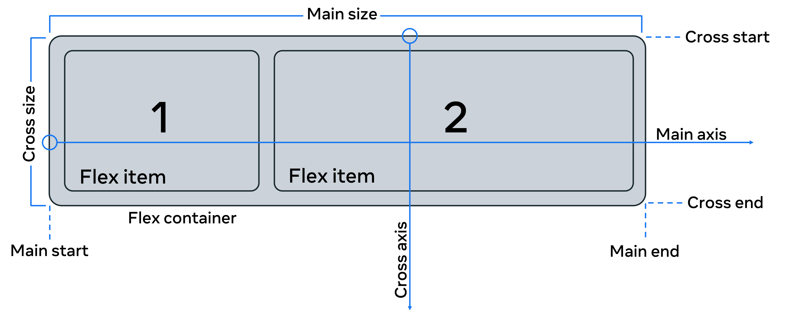

Image source: https://css-tricks.com/snippets/css/a-guide-to-flexbox/#aa-basics-and-terminology

Let’s now examine some of the important properties that will allow you to configure a flexbox.

## Flexbox properties

Original HTML code:

```html
<body>
    <div class="flex-container">
        <div class="box box1">  One..</div>
        <div class="box box2">  Two..</div>
        <div class="box box3">  Three..</div>
        <div class="box box4">  Four..</div>
        <div class="box box5">  Five..</div>
        <div class="box box6">  Six..</div>
        <div class="box box7">  Seven..</div>
    </div>
</body>
```

Original CSS file: 

```css
.box{
    background-color: aquamarine;
    border-radius: 5px;
    margin: 2px;
    padding: 10px;
}
```

Output:

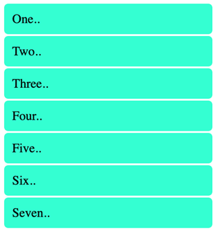

There are seven div containers inside the HTML file.

The corresponding CSS file contains rules for all seven div tags that have the box class. Note how two class names are given for each of the tags, one that is common among all classes and another independent of it. The style is applied to all the containers. 

Now let’s add properties to the flex container by converting it into flex.

__display: flex;__

```css
.flex-container{
    display: flex;
}
```

The output is now seven flex containers that run from left to right starting in the top left corner.

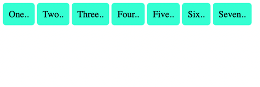

## Alignment properties

Let’s examine a few alignment properties inside the flex. There are four main properties used to align a flex container and items present inside it:  

- `justify-content`. For item alignment on main axis.

- `align-items`. For item alignment on cross axis.

- `align-self`. For unique flex items on cross axis.

- `align-content`. Used for packing flex lines and control over space.

Of these, justify-content and align-items are frequently used for the respective two axes. 

Let’s first examine the use of justify-content which has a value of ‘left’ by default.

__justify-content__

CSS:

```css
.flex-container{
    display: flex;
    justify-content: center
}
```

Output:

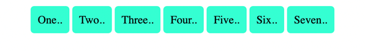

__flex-wrap:__

The default for this property is ‘nowrap’ which means the items will span the entire width of the axis. 

```css
.flex-container{
    display: flex;
    justify-content: center;
    flex-wrap: wrap;
}
```

Output:

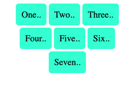

The items will now be wrapped to the size of the available viewport. 

__flex-direction:__

This property is used to set the main axis, which is a ‘row’ by default. It basically means you are changing your ‘main’ axis from horizontal rows to vertical columns. 

CSS Code:

```css
.flex-container{
    display: flex;
    justify-content: center;
    flex-direction: column;
    flex-wrap: wrap;
}
```

Output:

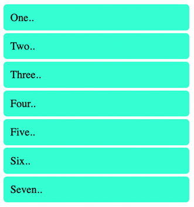

The output looks like the original output; however, it is now actually a flex.

Now let’s align the items again and examine a couple of the other properties mentioned earlier.   

__align-items:__

The alignment on the cross-axis is done with the help of this property. Let’s change the value for it to ‘flex-end’. 

CSS Code:

```css
.flex-container{
    display: flex;
    justify-content: center;
    flex-direction: column;
    flex-wrap: wrap;
    align-items:flex-end;
}
```

Output:

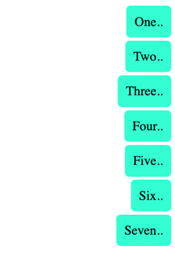

The term ‘end’ refers to the right side of the page as the left side is seen as the beginning. 

__align-self:__

This property can be used on individual items inside the flex.

```css
.flex-container{
    display: flex;
    justify-content: center;
    flex-direction: column;
    flex-wrap: wrap;
    align-items:flex-end;
}
.box3{
    background-color: blanchedalmond;
    align-self: center;
}
```

Output:

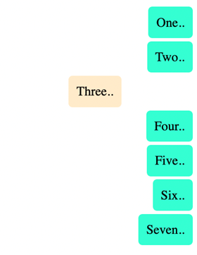

Here the color and alignment of the third box have been changed and it overrides the properties set using align-items.     

__gap:__

gap property can be used to create space between the items along the main axis. You can also individually configure the gaps in rows and columns using row-gap and column-gap properties.   

CSS Code:

```css
.flex-container{
    display: flex;
    justify-content: center;
    flex-direction: column;
    flex-wrap: wrap;
    align-items:flex-end;
    gap:10px;
}
.box3{
    background-color: blanchedalmond;
    align-self: center;
}
```

Output:

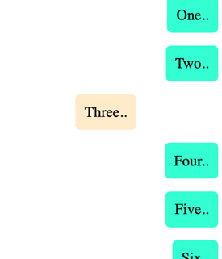

There is a clear change in spacing between the items. 

The final set of properties are flex-grow, flex-shrink and flex-basis. Together these determine how the flex takes up space, grows or shrinks according to the space available.

These are the sub-properties of a property called flex. Together all three properties can also be given values with the help of something called the shorthand notation in CSS. Shorthand notation helps you make your code compact and also easy to write and follow. The values left empty in shorthand notation are given their default values. 

For example:

```css
.flex-container{
    flex: 0 1 auto;
}
```

Here for the flex-container class, there is a set rule for the flex property. The values correspond to the three properties, namely the flex-grow set to 0, flex-shrink to 1 and flex-basis to auto. The flex-basis sets the initial size of the container. and together they define the rigidity or flexibility and dynamism you want to add to the flexbox. 

To demonstrate the effect of this, the code has to be modified slightly by removing the flex-direction value set to ‘column’. This will change it to default ‘row’ and the output will again be centrally aligned and horizontal best-distributed between two rows. 

Output:

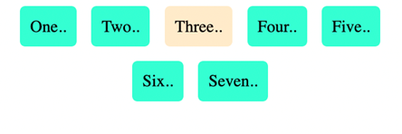

The rest of the remaining code is unchanged. However, the output will change if the code is modified with the addition of the flex property inside the flex item box3 class. 

CSS Code:

```css
.box3{
    background-color: blanchedalmond;
    align-self: center;
    flex: 1 1 auto;
}
```

Output:

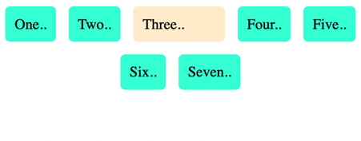

The third box now takes up the entire free space available because flex-growth’s value has been set to 1. So if we have `flex-grow` set to 1, the children will all set to equal size. And if one of the children has a value of 1.5, that child would take up more space as compared to the others.

It’s important to understand how the changes in the main and cross axis affect the way you imagine and manipulate the flexbox. Once you’ve had more practice you’ll be more comfortable with the use of these properties, and it will become easier to use flexboxes and understand the flow and alignment of items inside the flexbox.