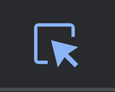
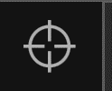
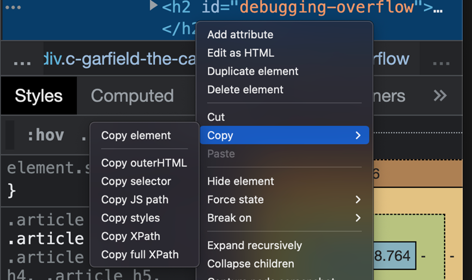
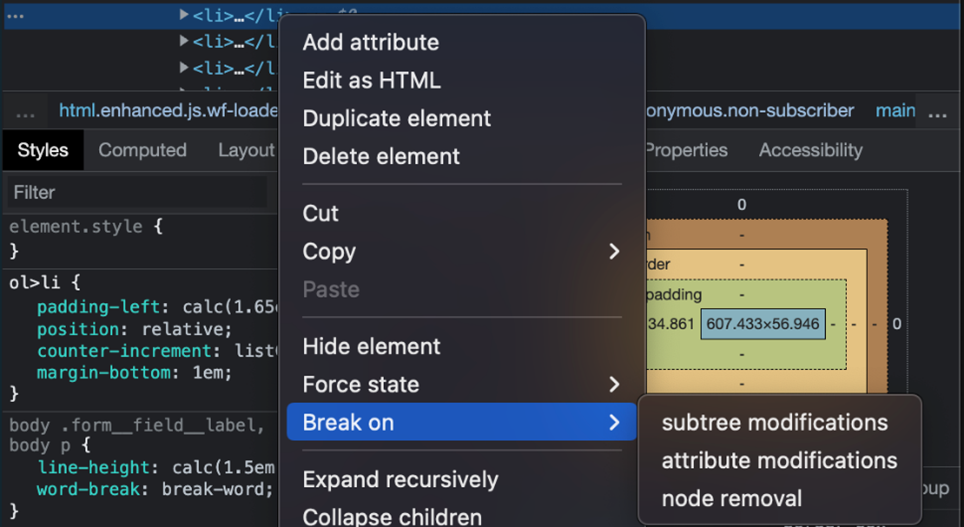
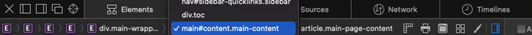

# Debugging the front-end

CSS is a styling language, unlike conventional programming languages such as Python and Java, that has controls and follows a logical structure. This can make it difficult to find the exact root of the problem. Additionally, as you know, CSS does not flag errors, and most of the ‘bugs’ that you see in CSS are aesthetic in nature and need human intervention to solve.  The task of debugging the front-end is more about experience than knowledge.   

The first step in debugging CSS is to find the root of the issue and isolate the elements involved. The majority of CSS issues will be with the layout, such as:  

Content overflow from parent to child or container class

Misplaced elements in relation to its container class   

Browser and device-related inconsistencies resulting in variable viewports

Isolation by reduced test case  
One way to deal with a problem is to replicate your code and systematically remove any code unrelated to the HTML and CSS elements that could be the source of the problem. The code should be distilled down to the least amount of code possible, and only then are suitable changes made to get the results you want. Alternatively, you can enable rules one at a time to observe their impact on the displayed elements.   

Items inside containers  
Often, isolation will not work, as the problem is the result of the relative mapping of elements. For example, with the misconfigured width of an item inside a flex layout. It’s important to check the use of suitable CSS properties in such cases. For a given item inside a grid, depending on the use case, width, grid-template-column, margin and padding can all be used to give spacing to an element. Additionally, you can also set different units that will all have their own behavior. In most cases, it helps to be familiar with the unit of measurement in relation to the container type to avoid misconfigurations.    

Relocating items  
Similar to the isolation of elements, you can move a certain element to observe its behavior. Doing a comparison can often help you to understand the source of the problem.   

The CSS compiler reads the elements from right to left. As an example, for a selector such as div .alpha > p, the element read first will be p before moving ‘outside’. When you change the position of the p from inside the .alpha class to some other position inside your code, it is easier to debug the source of the problem. This should be done on a case-specific basis.     

Getting familiar with the box model  
The box model is a very powerful source of information and can solve many issues with alignment. Using margin, padding and border is useful, but can be tricky and must be well understood.     

Browser issues  
Many times, the styling you have renders correctly in the IDE but misbehaves in a browser. That is because browsers have their own default CSS stylesheets called user-agent styles. While modern-day browsers are mostly compatible, you may encounter minor inconsistencies. Overriding the browser's settings can be done with universal selectors, in such cases written at the top of the code, and will include properties such as ‘margin: 0px;’ to reset the margin values set by the browser by default.     

Dev tools  
There are lots of user-friendly tools available today that can help debug CSS. However, the best tool you can use is the one provided by the browsers, called the developer tools, or dev tools. You can find these by right-clicking on a web page and selecting ‘Inspect Element’. option Note how every browser has its own expression when it comes to the configuration options, but fundamentally they are similar. Browsers today are very powerful pieces of software. If you spend time exploring the options, you may not need any other additional tools or software for debugging CSS and other front-end languages.     

A couple of the important options you can find inside your browser include:  

Sources: Lists the filenames such as HTML, and CSS files used by the webpage that can be explored   

Elements: Scrolls through the code to select a specific element for exploration    

Inside the Elements tab, on the right-hand side, you will find several options such as Computed layouts that will show the box model, Layouts that contain page and grid overlay options, and Font.    

You can select a specific element much more easily with the help of the ‘Element selection’ icon inside the dev tools. It enables the selection of specific elements on your web page. You can also access this option by hovering over a specific element on your page that will display its properties to you. 

On selecting the desired element, one way to use the Elements tab for debugging is by right-clicking on that element, scrolling to ‘Copy’ and then selecting an option from the drop-down list that appears. 

This way, you can explore the isolated code to find the problem. 

Additionally, you can add the Breakpoint option that is more useful for interactive pages by selecting the ‘Break on’ option and selecting an option from the dropdown list that appears.

Nowadays, some browsers are providing options such as Cumulative Layout Shift (CLS) that helps determine the overall efficiency of a web page. 

You can also bring up the element families by clicking on the horizontal bar: 

One very useful feature is the ability to make changes in your code directly inside the browser. First, use the ‘element selector’ mentioned above to select some elements and then look for the ‘+’ icon inside the dev tools. You can directly start adding relevant rules for that particular element which will immediately display changes on your web page. The changes you make can also be tracked from the ‘Changes’ tab. The live interactive nature of this feature greatly improves the experience of debugging. 

‘Console’ is another feature that, although it is not that useful in CSS, will come in handy as you deal with active or dynamic web pages along your developer journey.   

There are also responsive design modes in CSS that allow you to render your webpage to a specific browser or device. In addition to these, there are numerous ways in which you can explore and configure settings inside dev tools. 

When it comes to designing and styling CSS, if you don’t understand how it works, all issues will appear to be bugs. If you look at the fundamental structure of CSS, it consists of rulesets containing selectors and declaration blocks that contain properties and values. Micro-assessment of formatting and its validity can be done to troubleshoot the source of the problem. Practicing the creation of web pages and exploring the dev tools is the best way to get better at debugging and CSS in general.