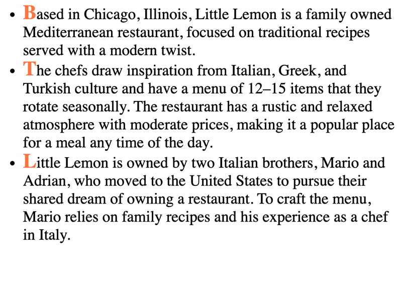
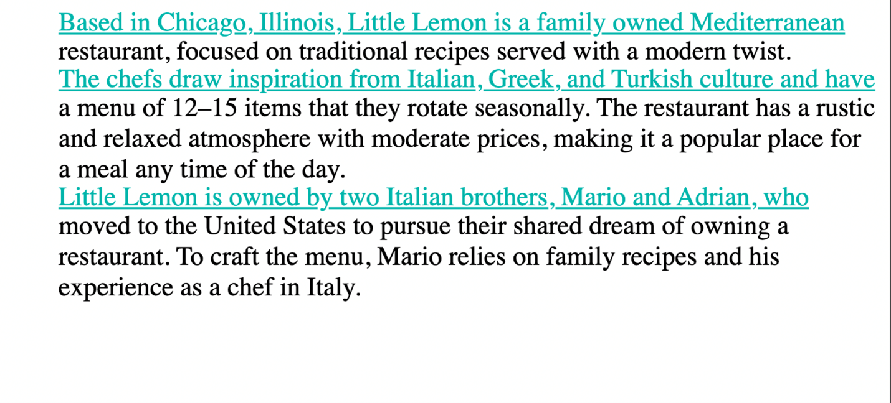
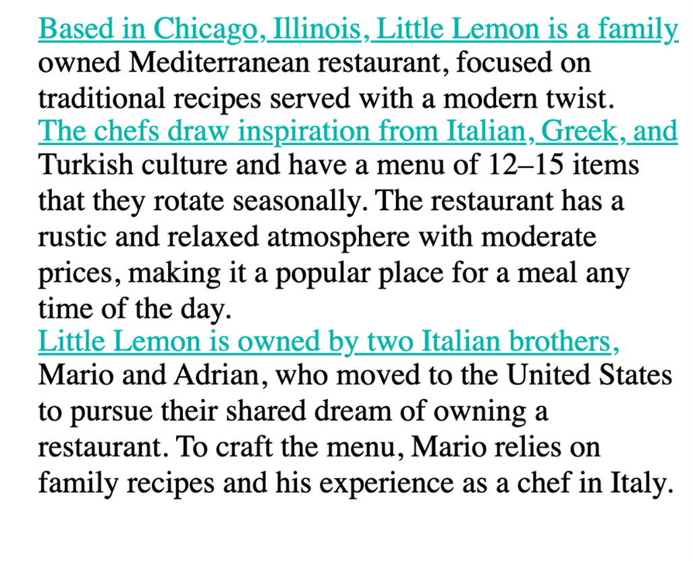
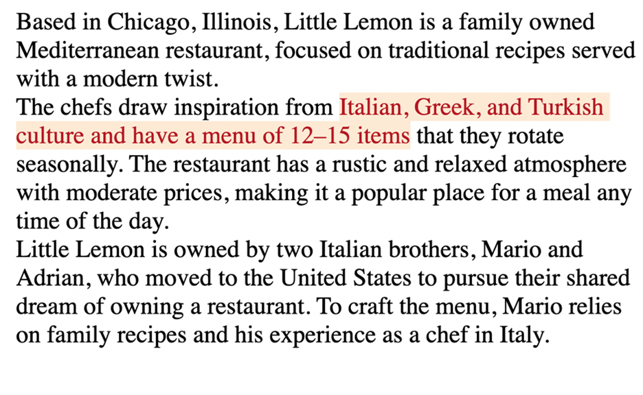
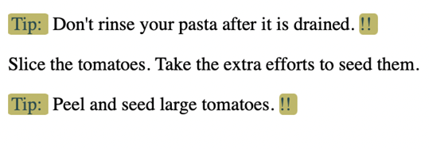

# Pseudo-elements

## Syntax

```css
selector::pseudo-element {
    property: value; 
}
```

It is important to note that pseudo-elements use two colon characters instead of one.

Now, let’s explore some examples of popular pseudo-elements.

## ::first-letter

You can use first-letter to change the color of just the first letter of each of the three points in the example text.

HTML code:
```html
<!DOCTYPE html> 
<html> 
    <head>
        <link rel="stylesheet" href="pseudo4.css"> 
    </head>
    <body>
        <ul>
            <li>Based in Chicago, Illinois, Little Lemon is a family-owned Mediterranean restaurant, focused on traditional recipes served with a modern twist. </li>
            <li>The chefs draw inspiration from Italian, Greek, and Turkish culture and have a menu of 12–15 items that they rotate seasonally. The restaurant has a rustic and relaxed atmosphere with moderate prices, making it a popular place for a meal any time of the day.</li>
            <li>Little Lemon is owned by two Italian brothers, Mario and Adrian, who moved to the United States to pursue their shared dream of owning a restaurant. To craft the menu, Mario relies on family recipes and his experience as a chef in Italy.</li>
        </ul>
    </body>
</html> 
```

CSS code:
```css
li::first-letter { 
    color:coral; 
    font-size: 1.3em; 
    font-weight: bold; 
    line-height: 1; 
} 
```

Output



Although the code only changed the first letter of each bullet point, it makes a big difference in terms of presentation. Now let’s change the font in a different way. 

## ::first-line

First-line will change the complete first line of each of the bullet points to light sea green. 

CSS code:
```css
ul {
    list-style-type: none;
}

li::first-line {
    color: lightseagreen;
    text-decoration: underline;
    line-height: 1;
}
```

Output:



Because it’s only the first line of each bullet point, it almost functions like dividers between the three different points instead of having to rely on bullets.  

Note that the contents of the line to which this pseudo-element is applied will change as you increase or decrease the size of your viewport. 

Output:



## ::selection

Selection is another useful pseudo-element. For example, you may use it when you are taking notes on your device because it allows you to highlight specific text. The effect of it becomes obvious only after the user selects content. On web pages today, you will typically see inverted colors from white-black to black-white when selecting a portion of text.

CSS code:
```css
ul{
    list-style-type: none;
}

li::selection {
    color:brown;
    background-color: antiquewhite;
    line-height: 1;
}
```

Here is an example of a selection of text.

Output:



And another example of the same text but with a different section selected and highlighted.

Output:


Different segments of the text are highlighted depending on the text that is selected at any given point.    

## ::marker

Markers are typically used to add style elements to a list, for instance, to color bullet points. For example, you can enhance the user experience when you use a marker in the following way.    

CSS code:
```css
li::marker {
    color: cornflowerblue;
    content: '<> ';
    font-size: 1.1em;
}
```

Output


Now the bullet points are cornflower blue and they have the shape specified in the code.

## ::before and ::after

One more pair of pseudo-elements are the __::before__ and __::after__ pseudo-elements. They allow you to add content before and after an element on which they are allowed. In other words, new content can be added to a page without adding HTML code for it. You can also add styling options for this content. Let’s do an example where text is added both before and after some cooking guidelines to identify them as important tips. 

HTML code:
```html
<body>
    <p id="tips"> Don't rinse your pasta after it is drained. </p>
    <p> Slice the tomatoes. Take the extra efforts to seed them. </p>
    <p id="tips"> Peel and seed large tomatoes. </p>
</body>
```

CSS code:
```css
#tips::before{
    background: darkkhaki;
    color:darkslategray;
    content: "Tip:";
    padding-left: 3px;
    padding-right: 5px;
    border-radius: 10%;
}

#tips::after{
    background:darkkhaki;
    color:darkslategray;
    content: "!!";
    padding-right: 5px;
    border-radius: 20%;
}
```

Output:



The “content” property is where the text for the guidelines goes. The word “tip” has been added before each guideline thanks to the rules added for __tips::before__. And, each of the three guidelines now has two exclamation marks after them thanks to the rules added for __tips::after__. Note how the second `<p>` element inside the HTML code remains unaffected. You don’t have to use after and before together like this, but sometimes it is useful to combine them.

The examples covered here illustrate that adding simple code for pseudo-elements can greatly enhance the appearance of websites. There are plenty of other pseudo-elements and some of them are more popular than others. You can follow your own style and explore the creative possibilities that pseudo-classes and pseudo-elements offer.