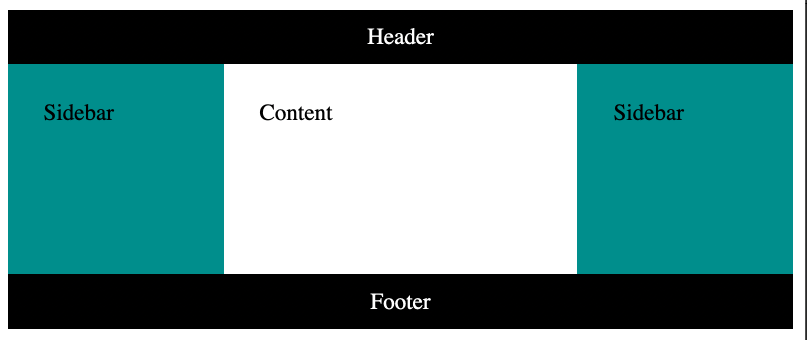
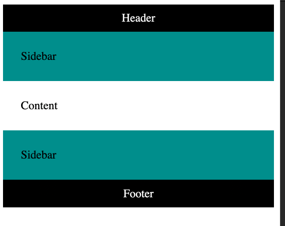

# Create a grid layout

## Introduction

In this lab, you will be creating a grid layout commonly called the Holy Grail layout.

## Goal

- To create a grid layout  using the grid template area 

## Objectives

- Add styling to the CSS page with the help of the grid template area 

- Configure rules for different properties inside the grid template area

## Instructions

Initial code for the HTML is already provided. The rules for different areas within the grid template area are already provided in the CSS code. You have to add the rules for the container class as per the instructions provided.

The two set of rules to be added for the container class will have one set for regular __container__ class and another using media query for a different size. Follow the instructions below.

First, write rules by adding properties for the __container__ class as below.

__Step 1:__ Add a display property that will create a grid.
```css
display: grid;
```

__Step 2:__ It should have a maximum width of 900 pixels.
```css
max-width: 900px;
```

__Step 3:__ The minimum height for it will be the length of 50 viewport height.
```css
min-height: 50vh;
```

__Step 4:__ Add a property for grid template columns that will span 100 % of the width.
```css
grid-template-columns: 100%;
```

__Step 5:__ Add a property for grid template values for five rows, of which the middle one will have a value of 1 fractional area and the rest will be set to auto.
```css
grid-template-rows: auto auto 1fr auto auto;
```

__Step 6:__ Finally, you will create a grid template area that will contain five values: __header__, __left__, __main__, __right__ and __footer__.
```css
grid-template-areas: "header" "left" "main" "right" "footer";
```

Similar to the rules you have defined above, you will again add a different set of rules inside the media query when the minimum width of the viewport is 440 pixels. 

__Step 7:__ For the container class the three grid template columns will have respective values of 150 pixels, 1 fractional area and 150 pixels again.
```css
grid-template-columns: 150px 1fr 150px;
```

__Step 8:__ For the three grid template rows , the middle value should be 1 fractional, while the two others will be set to auto.
```css
grid-template-rows: auto 1fr auto;
```

__Step 9:__ This time, you will be creating a 3 x 3 grid template area that will have only header in the first row. It will have __left__, __main__ and __right__ in the second row and finally have only __footer__ in the last row.
```css
grid-template-areas: "header header header" 
                     "left main right" 
					 "footer footer footer";
```

Finally, you should preview your code and see the final output.  Try resizing your browser viewport to see how the layout changes.



